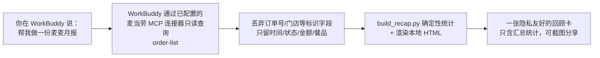

# 麦麦回忆局（McD Replay）

> 把你真实点过的麦当劳订单，整理成一份有数据依据、保护隐私、可以分享的个人回顾；需要时再结合当前可用优惠给出下次点单参考。

**输入什么 → 调用什么 → 产出什么（10 秒看懂）：**




- **问题场景**：报名 Issue 里已有大量“推荐套餐/省钱助手”，但没有人回答“我最近都点了什么、花了多少、什么时候最常点”。
- **目标用户**：使用麦当劳 App 点餐、并愿意通过官方 MCP 授权查询自己订单记录的个人用户。
- **产出**：本地 HTML 回顾卡（手机竖屏友好，自己截图分享），外加按需的“下一餐优惠”建议。

演示卡（**合成示例数据**，非真实账户）：[`mcd-replay-skill/examples/synthetic-recap-card.html`](mcd-replay-skill/examples/synthetic-recap-card.html)，配套输入 [`synthetic-recap.json`](mcd-replay-skill/examples/synthetic-recap.json)。

---

## 目录结构

```text
mcd-replay/
├── README.md                      # 本文件
├── CONTEST_DECLARATION.md         # 官方参赛声明（逐字复制，不可修改）
├── MCP_INTEGRATION.md             # MCP 实际调用说明与验证情况
├── mcp-config.example.json        # 脱敏配置样例（仅环境变量占位符）
├── workbuddy.md                   # WorkBuddy 真实开发过程记录（已脱敏）
├── .gitignore
├── mcd-replay-skill/              # Skill 源目录
│   ├── SKILL.md                   # 技能定义（YAML frontmatter + 指令正文）
│   ├── references/mcp-tool-map.md # 工具映射、只读约定与隐私处理
│   ├── scripts/build_recap.py     # 统计+卡片生成（不联网、不读密钥）
│   ├── templates/recap-card.html  # 原创卡片模板
│   └── examples/                  # 合成示例数据与演示卡（醒目标注）
└── dist/mcd-replay-skill.zip      # 可导入 WorkBuddy 的 Skill 包
```

## 安装方式

### 第 1 步：申请麦当劳 MCP Token

1. 打开 [麦当劳 MCP 官网](https://open.mcd.cn/mcp)，用手机号登录。
2. 点右上角“控制台”→“激活”，同意服务协议，复制 MCP Token。
3. Token 只用于下一步的连接器配置窗口，**不要**贴进聊天、截图或任何文件。

### 第 2 步：在 WorkBuddy 配置连接器

1. WorkBuddy 左侧【专家·技能·连接器】→【连接器】→【自定义连接器】→【配置 MCP】。
2. 粘贴以下 JSON，把占位符换成你的真实 Token（只在这个窗口替换）：

   ```json
   {
     "mcpServers": {
       "mcd-mcp": {
         "type": "streamablehttp",
         "url": "https://mcp.mcd.cn",
         "headers": {
           "Authorization": "Bearer 在这里粘贴你自己的Token"
         }
       }
     }
   }
   ```

3. 保存并启用 `mcd-mcp`，确认连接器显示已连接、能看到麦当劳工具。

> 仓库里的 [`mcp-config.example.json`](mcp-config.example.json) 只是文档样例，Token 值为环境变量占位符 `${MCD_MCP_TOKEN}`；真实 Token 只应在 WorkBuddy 连接器配置界面输入。

### 第 3 步：导入 Skill

1. 【专家·技能·连接器】→【技能】→【添加技能】→【上传技能】。
2. 选择 `dist/mcd-replay-skill.zip`，安装并开启。

### 更新方式

重新打包 `mcd-replay-skill/` 目录为 ZIP（ZIP 内技能根目录直接包含 `SKILL.md`），在 WorkBuddy 中重新上传覆盖安装即可。

## 使用示例（可直接复制）

**示例 1 —— 月报/回顾：**

```text
帮我做一份麦麦月报，回顾我最近点过的麦当劳订单，生成一张回顾卡。
```

**示例 2 —— 隐私回顾卡：**

```text
把回顾做成一张可以截图分享的卡片，只放汇总统计，不要出现门店名和任何订单明细。
```


**示例 3 —— 优惠查询与下次点单参考：**

```text
看看我现在有哪些麦当劳优惠券快到期了；我今晚想去XX商圈的麦当劳到店取餐，预算30元，按当前在售菜单和可用券给我两三个组合建议，算出实付金额，但不要帮我下单。
```


## 实际调用哪些 MCP 工具、需要什么授权

| 功能 | 调用的只读工具 | 说明 |
|---|---|---|
| 订单回顾（核心） | `order-list`、`now-time-info` | 读取你账户的近期历史订单；已实测 |
| 优惠参考（按需） | `query-my-coupons`、`campaign-calendar` | 查你已拥有的券与当月活动；已实测 |
| 门店级建议（按需） | `query-meals`、`query-store-coupons`、`calculate-price` | 你确认门店与取餐方式后才调用；本次开发未实测，详见 MCP_INTEGRATION.md |

- **授权范围**：仅查询你已登录麦当劳账号的数据；Token 由你在官方控制台申请并自行保管。
- **只读承诺**：本项目不调用 `create-order`、`cancel-order`、`auto-bind-coupons`、`draw-lottery`、`mall-create-order`、`party-order-create` 等任何写操作。
- **统计口径**：金额、订单数、时段、餐品统计由 `scripts/build_recap.py` 确定性计算；AI 只负责解释，不改写统计结果。退款/取消/失败订单单独列出，不计入消费统计。接口返回区间不完整时，卡片显著标注“仅统计本次接口返回记录”。

## 隐私与安全

- 分享卡只含汇总统计，不出现姓名、手机号、地址、订单号、会员号、Token、券码、精确门店地址或单笔明细。
- 项目自身不增加任何数据上传服务，不记录 MCP 原始响应；真实查询经过你已授权的麦当劳 MCP 与 WorkBuddy 对话链路，数据处理遵守这两个服务各自的条款。
- 真实订单数据不写入项目文件、样例、截图或 Git；`.gitignore` 已覆盖 `.env`、Token 文件、真实导出与个人报告。
- 生成 HTML 时对所有文本做转义，不将接口返回文本作为 HTML/脚本执行。
- 演示数据为完全虚构的合成数据（卡片带“示例数据”水印），不仿造真实账户、订单号或 Token。

## 常见故障

| 现象 | 原因 | 处理 |
|---|---|---|
| 401 | Token 无效/过期/未配置 | 到 https://open.mcd.cn/mcp 控制台重新激活获取 Token，在 WorkBuddy 连接器配置中更新 |
| 429 | 超过每 Token 每分钟 600 次限流 | 降低调用频率，稍等再试 |
| 订单很少或没有 | 接口只返回近期记录 / 近期确实无订单 | 如实展示返回区间，卡片注明“仅统计本次接口返回记录” |
| 无法给门店级建议 | 未提供门店或取餐方式 | 先告知 Skill 门店商圈与到店/外送，再重试 |

## 免责声明

本项目为个人参赛作品，**非麦当劳官方产品**，不代表麦当劳立场，未获得麦当劳商标授权。价格、餐品、活动、优惠以你当前的 MCP 查询结果和麦当劳官方渠道为准。项目输出仅供个人参考，不构成理财、医疗或营养建议。麦当劳 MCP 及品牌权利归麦当劳（金拱门（中国）有限公司）所有。

## 项目亮点与开发方式

- **差异化定位**：不做第 N 个“套餐推荐”，做“订单历史复盘 + 隐私友好分享卡”。
- **确定性统计**：可计算字段全部由 Python 脚本算出，模型不改写数字，统计可复现。
- **隐私设计**：标识字段在进入统计前即丢弃；分享卡只含汇总；合成示例与真实数据严格分离。
- **真实 WorkBuddy 开发**：从阅读官方规则、实测 MCP 只读工具，到编写 Skill、注入测试、打包 ZIP，全流程在 WorkBuddy 中完成，过程记录见 [`workbuddy.md`](workbuddy.md)。
